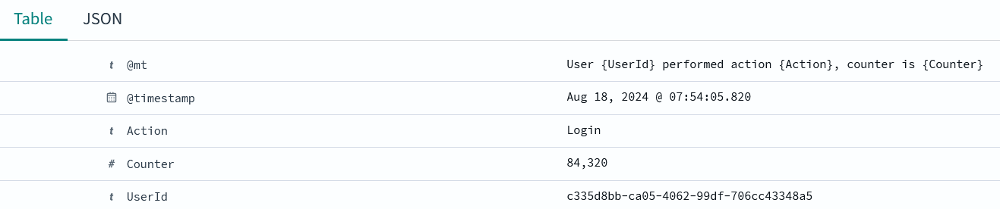

# Docker structured logging using Filebeat and OpenSearch

This repo shows a demo how to do structured logging from a [Docker](https://www.docker.com/) container.

## How to run

```docker compose up -d```

## How to stop

``` docker compose down -v```

## Serilog code

```C#
Log.Information("User {UserId} performed action {Action}, counter is {Counter}", userId, action, counter);
```

## Docker log

```docker logs loggenerator```:
```json
{"@t":"2024-08-18T05:44:44.7034927Z","@mt":"User {UserId} performed action {Action}, counter is {Counter}","UserId":"186cfe36-dcfb-4b16-9393-498d5a7cdc2a","Action":"Login","Counter":83759}
```
Serilog is logging json. Since Docker uses the json-file driver, the logging ends up in a json file.

/var/lib/docker/containers/<container-id>/<container-id>-json.log:
```json
{"log":"{\"@t\":\"2024-08-18T05:46:46.7267285Z\",\"@mt\":\"User {UserId} performed action {Action}, counter is {Counter}\",\"UserId\":\"08abf177-7294-4ee0-8e78-1c58ab891df9\",\"Action\":\"Login\",\"Counter\":83881}\n","stream":"stdout","time":"2024-08-18T05:46:46.726879595Z"}
```
So the docker json log file contains nested json.

## Filebeat

The structured logging is picked up by [Filebeat](https://www.elastic.co/beats/filebeat) and
sent to [OpenSearch](https://opensearch.org/) to be stored.

Filebeat parses Docker's json file, parses the nested json and adds the values to the document before sending it to OpenSearch.

## OpenSearch Dashboards

The data can then be searched and visualized with [OpenSearch Dashboards](https://www.opensearch.org/docs/latest/dashboards/).
Visit http://localhost:5601 (or wherever you run docker compose). Log in using admin/T!mberW0lf#92.
Click on the hamburger menu and select 'Discover'. First you'll be asked to create an index pattern.
Enter 'filebeat-*' and click Next.
Select '@timestamp' to use as timestamps and click Create.
Now you'll be redirected to the Discover page where you can inspect the logged data:

